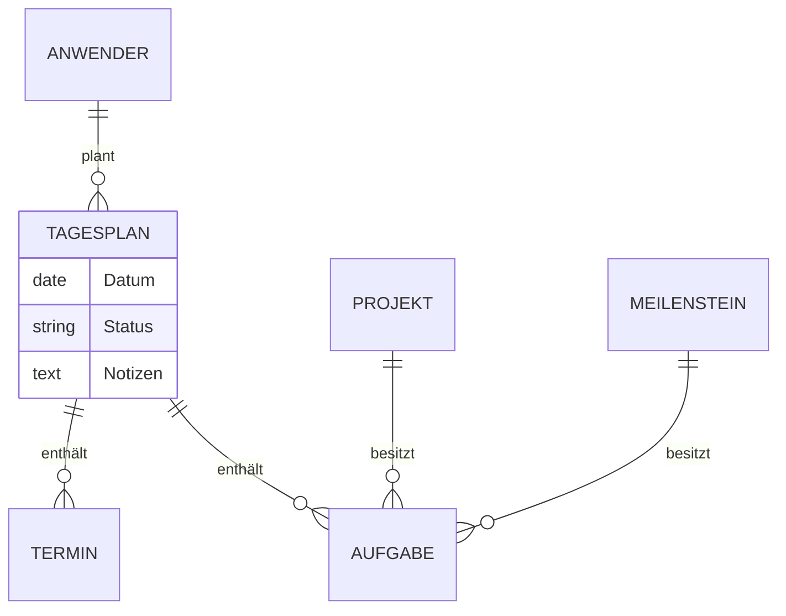

# Feature: Tagesplanung

## Persönliche Tagesplanung ohne Projektkontext

### Ziel / Zweck

Der Anwender kann seinen Arbeitstag eigenständig strukturieren — unabhängig davon, ob die anfallenden Aufgaben und Termine einem Projekt zugeordnet sind. Die Tagesplanung schafft einen persönlichen Planungsraum, der täglich neu befüllt wird und den Fokus auf das Wesentliche des jeweiligen Tages lenkt.

### Fachliche Beschreibung

Die Tagesplanung ist ein eigener Bereich in der Navigation, der immer den aktuellen Tag zeigt. Der Anwender kann zwischen Tagen vor- und zurücknavigieren oder über eine Datumsauswahl direkt zu einem bestimmten Tag springen.

**Aufgaben im Tagesplan**

Für jeden Tag können Aufgaben direkt angelegt werden — ohne dass ein Projekt oder Meilenstein ausgewählt werden muss. Eine Tagesaufgabe hat Titel, Priorität und ein automatisch gesetztes Fälligkeitsdatum (der gewählte Tag). Der Anwender kann den Status einer Aufgabe direkt im Tagesplan umschalten: von offen auf erledigt und zurück. Soll eine Aufgabe nicht mehr im Tagesplan erscheinen, kann sie daraus gelöst werden — die Aufgabe selbst bleibt erhalten und geht nicht verloren.

Aufgaben, die bereits in einem Projekt oder Meilenstein existieren, können ebenfalls in den Tagesplan aufgenommen werden. So lässt sich der Tagesplan als persönliche Fokusansicht über Projektgrenzen hinweg nutzen.

**Termine im Tagesplan**

Termine werden mit Titel, Start- und Endzeit sowie optional einer Ganztägig-Markierung angelegt. Auch hier ist kein Projektbezug erforderlich. Wie bei Aufgaben können Termine aus dem Tagesplan gelöst werden, ohne dass der Termin selbst gelöscht wird.

**Tagesnotizen**

Jeder Tag verfügt über ein freies Notizfeld. Der Anwender kann dort Gedanken, Prioritäten oder Hinweise für den Tag festhalten. Die Notizen werden beim Speichern dem jeweiligen Tagesplan zugeordnet.

**Tagesstatus**

Ein Tagesplan kann als „Abgeschlossen" markiert werden, wenn alle Aufgaben erledigt sind. Dieser Status kann jederzeit wieder zurückgesetzt werden.

### Regeln & Randbedingungen

- Pro Anwender und Kalendertag existiert genau ein Tagesplan.
- Ein Tagesplan wird automatisch angelegt, sobald der Anwender den jeweiligen Tag öffnet — es gibt keine explizite „Erstellen"-Aktion.
- Aufgaben und Termine im Tagesplan können gleichzeitig einem Projekt angehören — beides schließt sich nicht aus.
- Subtasks (Unteraufgaben) können nicht direkt in den Tagesplan aufgenommen werden.
- Das Lösen einer Aufgabe oder eines Termins aus dem Tagesplan löscht das Objekt nicht — es entfernt nur die Zuordnung zum jeweiligen Tag.
- Alle Schreiboperationen (Aufgaben anlegen, Termine anlegen, Status ändern) erfordern eine aktive Anmeldung; rein lesende Zugriffe sind für Nutzer mit Leserecht möglich.
- Änderungen am Tagesplan sind versioniert — gleichzeitige Bearbeitungen durch denselben Nutzer werden erkannt und mit einem Hinweis abgewiesen.

## Architektur & Kontext

### Betroffene Datenbereiche

**Tagesplan** — der zentrale Datensatz je Anwender und Tag. Hält Status, Notizen und den Verweis auf Aufgaben und Termine des Tages.

**Tagesplan-Aufgaben** — die Zuordnung zwischen einem Tagesplan und seinen Aufgaben, inklusive Anzeigereihenfolge.

**Tagesplan-Termine** — die Zuordnung zwischen einem Tagesplan und seinen Terminen, inklusive Anzeigereihenfolge.

**Aufgaben** — bestehende Entität; wird durch die Tagesplanung nicht verändert. Eine Aufgabe kann gleichzeitig einem Projekt, einem Meilenstein und einem oder mehreren Tagesplänen zugeordnet sein.

**Termine** — bestehende Entität; wird durch die Tagesplanung um den Besitzertyp „Tagesplan" erweitert.

### Verwandte Features & Abhängigkeiten

**Aufgabenverwaltung** — Aufgaben sind die gemeinsam genutzte Entität. Eine im Tagesplan angelegte Aufgabe kann nachträglich einem Projekt zugeordnet werden, ohne den Tagesbezug zu verlieren.

**Kalender** — Der Wochenkalender zeigt Termine unabhängig ihres Besitzers. Termine aus dem Tagesplan erscheinen dort mit der Herkunftsangabe „Tagesplan" und werden farblich unterschieden.

**Journal** — Alle Anlege-, Änderungs- und Verknüpfungsoperationen im Tagesplan werden im systemweiten Journal protokolliert und sind nachvollziehbar.

**Berechtigungen** — Die Tagesplanung folgt dem allgemeinen Rollenmodell der App. Nutzer mit Leserecht können Tagespläne einsehen, aber keine Aufgaben oder Termine anlegen.
